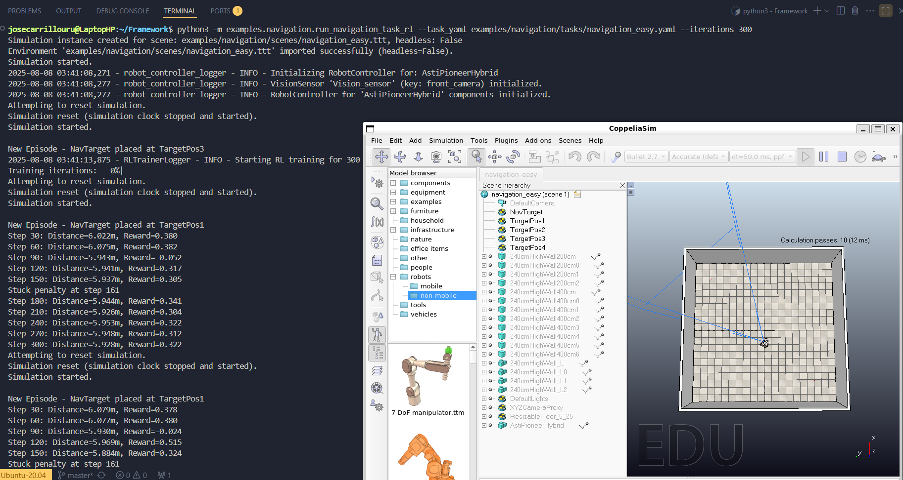
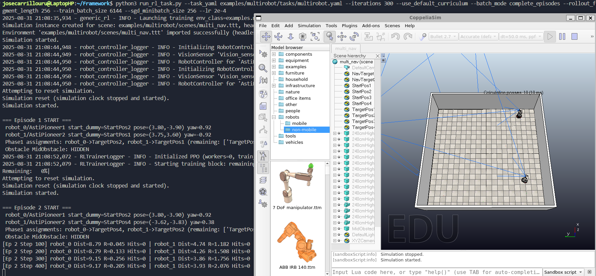
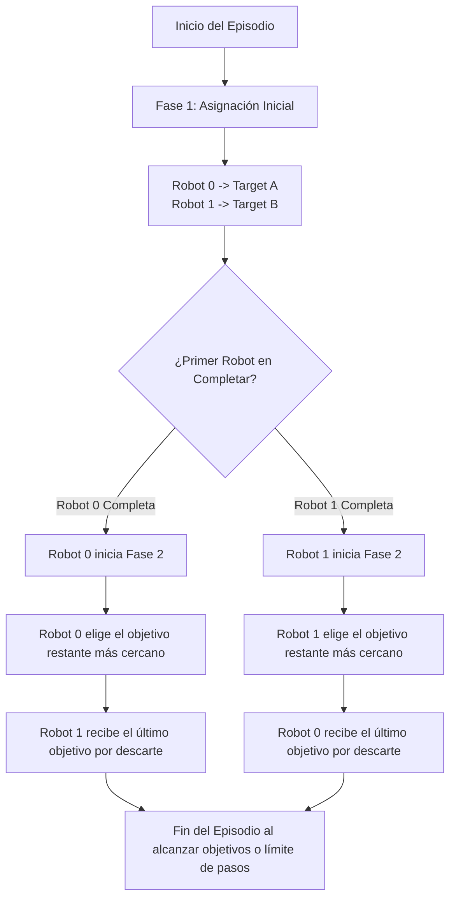
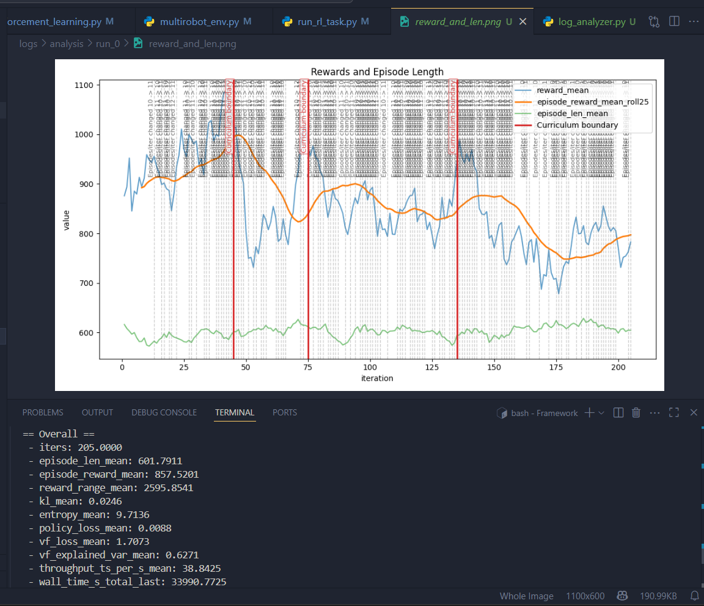

# Framework de Aprendizaje por Refuerzo para Robótica Móvil (CoppeliaSim + PyRep + Ray RLlib)

<p align="center">
  
  
  
  
  
  
</p>

Este repositorio contiene un framework modular diseñado para simular y entrenar robots móviles multifuncionales en **CoppeliaSim** utilizando **Aprendizaje por Refuerzo (RL)** de última generación con **Ray RLlib** e interfaces de comunicación rápidas y seguras gracias a **PyRep**. 

El núcleo del framework ha sido desarrollado con un enfoque estructurado y desacoplado, permitiendo el aislamiento entre la física del simulador, las definiciones de controladores de los robots, el modelado del entorno y la optimización de políticas de RL.

---

## Índice
1. [Resumen y Escenarios](#1-resumen-y-escenarios)
2. [Características Principales](#2-características-principales)
3. [Estructura del Repositorio](#3-estructura-del-repositorio)
4. [Inicio Rápido](#4-inicio-rápido)
5. [Prerrequisitos](#5-prerrequisitos)
6. [Ejecutor de Entrenamiento Universal](#6-ejecutor-de-entrenamiento-universal)
7. [Configuración de Tareas mediante YAML](#7-configuración-de-tareas-mediante-yaml)
8. [Matemática del Moldeado de Recompensas](#8-matemática-del-moldeado-de-recompensas)
9. [Lógica de Fase Multi-Agente](#9-lógica-de-fase-multi-agente)
10. [Flujo de Trabajo del Espacio de Trabajo del Usuario](#10-flujo-de-trabajo-del-espacio-de-trabajo-del-usuario)
11. [Creación de un Entorno Personalizado (Plantilla)](#11-creación-de-un-entorno-personalizado-plantilla)
12. [Exportación e Inferencia ONNX](#12-exportación-e-inferencia-onnx)
13. [Analizador de Logs y Reportes Estadísticos](#13-analizador-de-logs-y-reportes-estadísticos)
14. [Registros y Checkpoints](#14-registros-y-checkpoints)
15. [Extensión de Modelos de Robots](#15-extensión-de-modelos-de-robots)
16. [Solución de Problemas (Troubleshooting)](#16-solución-de-problemas-troubleshooting)
17. [Licencia y Contribuciones](#17-licencia-y-contribuciones)

---

## 1. Resumen y Escenarios

El framework soporta dos escenarios base principales que sirven de cimiento para el desarrollo de tareas robóticas más complejas:

### Escenario de Navegación Simple (Un Solo Robot)
Diseñado para el aprendizaje de navegación autónoma y evasión de obstáculos en entornos dinámicos simples. El agente recibe observaciones vectoriales de su pose, sensores de proximidad y posición de objetivo en movimiento.

<p align="center">
  
</p>

* **Clase del Entorno**: [`NavigationEnv`](examples/navigation/envs/navigation_env.py)
* **Escena**: `examples/navigation/scenes/navigation_easy.ttt`
* **Definición de Tarea**: `examples/navigation/tasks/navigation_easy.yaml`

### Escenario Cooperativo de Dos Robots (Multi-Robot)
Un escenario cooperativo de dos fases lógicas en el cual dos robots `AstiPioneerHybrid` deben navegar de manera simultánea en una escena compartida, resolviendo la asignación y recolección óptima de objetivos dinámicos, minimizando colisiones mutuas y de entorno.

<p align="center">
  
</p>

* **Clase del Entorno**: [`DynamicTwoPhaseNavEnv`](examples/multirobot/envs/multirobot_env.py)
* **Escena**: `examples/multirobot/scenes/multi_nav.ttt`
* **Definición de Tarea**: `examples/multirobot/tasks/multirobot.yaml`

---

## 2. Características Principales

* **Integración Eficiente con PyRep**: Wrapper optimizado sobre la API C++ de CoppeliaSim para ciclos rápidos de reset, step y recolección de observaciones de sensores y cámaras.
* **Controlador de Robot Unificado (`RobotController`)**: Capa de abstracción que gestiona de manera transparente los motores de tracción diferencial, sensores de proximidad ultrasónicos y flujos de cámaras RGB-D.
* **Algoritmos Multi-Agente**: Lógica integrada con Ray RLlib para el entrenamiento de políticas compartidas o independientes sobre espacios de observación híbridos (vectoriales + imágenes apiladas).
* **Moldeado de Recompensas Robusto**: Incorporación de recompensas basadas en potencial (PBRS), bonos de rampa y penalizaciones dinámicas por stuck/inactividad.
* **Espacio de Trabajo Desacoplado (`user_workspace/`)**: Permite a investigadores extender el framework añadiendo nuevas escenas 3D, controladores o lógicas Gym sin contaminar la arquitectura core.

---

## 3. Estructura del Repositorio

La arquitectura del framework se divide de la siguiente manera:

```
.
├── run_rl_task.py                 # Ejecutor universal de entrenamiento RL
├── log_analyzer.py                # Analizador estadístico y generador de gráficos
├── requirements.txt               # Lista de dependencias del sistema
├── Commands.md                    # Comandos de referencia rápida
├── examples/                      # Entornos de referencia de un solo robot y multi-robot
│   ├── navigation/                # Tareas de navegación de un solo robot
│   │   ├── envs/navigation_env.py # Entorno Gymnasium
│   │   ├── scenes/                # Escenas de CoppeliaSim (.ttt)
│   │   └── tasks/                 # Definiciones YAML de tareas
│   └── multirobot/                # Tareas multi-robot cooperativas
│       ├── envs/multirobot_env.py # Entorno Ray MultiAgent
│       ├── scenes/                # Escenas de CoppeliaSim (.ttt)
│       └── tasks/                 # Configuración de tareas
├── src/                           # Código fuente central del framework
│   ├── core/                      # Módulos centrales (Simulación, Controllers, RL)
│   │   ├── base_env.py            # Clase base abstracta de entorno
│   │   ├── simulation.py          # Manejo de ciclos de vida de CoppeliaSim
│   │   ├── robot_controller.py    # Interfaz física de sensores y actuadores
│   │   ├── robot_definitions.py   # Diccionarios de configuración del modelo
│   │   ├── reinforcement_learning.py # Wrapper de entrenamiento Ray/RLlib
│   │   └── curriculum_manager.py  # Gestor de dificultad progresiva (Curriculum)
│   ├── scripts/                   # Utilidades de automatización
│   │   └── export_onnx.py         # Exportador de políticas a redes ONNX
│   └── utils/                     # Conversores y exportadores de Blender/Unity
├── user_workspace/                # Sandbox seguro para aportes de usuario
├── docs/                          # Guías de referencia técnica y configuración
└── prevlogs/                      # Logs históricos de ejecuciones de prueba
```

---

## 4. Inicio Rápido

### Clonación e Instalación
Clonar el repositorio y preparar las dependencias en su entorno local (se recomienda Linux o WSL2):
```bash
git clone https://github.com/JACarrilloDev/Thesis-Framework.git ai_robotics_framework
cd ai_robotics_framework
pip install -r requirements.txt
```

### Ejecutar Entrenamiento de Ejemplo
Para iniciar el entrenamiento de la política cooperativa en el escenario multi-robot con 400 iteraciones y currículo de dificultad dinámico:
```bash
python3 run_rl_task.py --task_yaml examples/multirobot/tasks/multirobot.yaml --iterations 400 --use_default_curriculum
```

Para correr un entorno simple en modo visual (con GUI de CoppeliaSim):
```bash
python3 run_rl_task.py --task_yaml examples/navigation/tasks/navigation_easy.yaml --iterations 150
```

---

## 5. Prerrequisitos

* **Sistema Operativo**: Linux (Ubuntu 20.04/22.04) o Windows Subsystem for Linux (WSL2), requerido para el correcto funcionamiento de **PyRep**.
* **CoppeliaSim**: Instalación del simulador CoppeliaSim (versión 4.1 o superior recomendada). Asegúrese de exportar las variables de entorno necesarias:
  ```bash
  export COPPELIASIM_ROOT=/ruta/a/CoppeliaSim
  export LD_LIBRARY_PATH=$LD_LIBRARY_PATH:$COPPELIASIM_ROOT
  export QT_QPA_PLATFORM_PLUGIN_PATH=$COPPELIASIM_ROOT
  ```
* **Python**: Versiones soportadas de **3.9 a 3.11**.

---

## 6. Ejecutor de Entrenamiento Universal

El archivo principal [`run_rl_task.py`](run_rl_task.py) actúa como el punto de entrada unificado para lanzar simulaciones de RL. Permite definir la tarea robótica mediante dos estrategias en el YAML:

1. **Ruta Detección de Clase (Recomendada)**:
   ```yaml
   env_class: examples.multirobot.envs.multirobot_env.DynamicTwoPhaseNavEnv
   ```
2. **Respaldo Directo de Archivo**:
   ```yaml
   env_file: user_workspace/custom_envs/my_env.py
   env_class_name: MyCustomEnv
   ```

### Banderas Comunes de CLI:
* `--task_yaml`: Ruta del archivo YAML que especifica el entorno y los hiperparámetros.
* `--iterations`: Número de ciclos de actualización de la política (epochs).
* `--checkpoint_path`: Ruta de un checkpoint previo para restaurar el entrenamiento.
* `--headless`: Ejecuta CoppeliaSim en segundo plano sin instanciar la interfaz gráfica (mejora notablemente el rendimiento por paso de simulación).
* `--train_batch_size`: Tamaño del lote de datos colectados por iteración de Ray.

---

## 7. Configuración de Tareas mediante YAML

Los archivos YAML estructuran todos los detalles de la simulación y de la lógica de recompensas.

### Ejemplo de Tarea de Navegación de un Solo Robot (Mínimo):
```yaml
task_name: "Easy Navigation"
scene_file: "examples/navigation/scenes/navigation_easy.ttt"
env_class: src.core.navigation_env.NavigationEnv
robots_setup:
  - name: "AstiPioneerHybrid"
    type: "AstiPioneerHybrid"
max_episode_steps: 360
learning_objective:
  type: "navigate"
  target_object: "NavTarget"
  success_threshold_distance: 0.2
```

### Ejemplo de Tarea Multi-Robot (Curriculum y Específico):
```yaml
scene_file: examples/multirobot/scenes/multi_nav.ttt
env_class: examples.multirobot.envs.multirobot_env.DynamicTwoPhaseNavEnv
multi_agent: true
max_episode_steps: 650
success_dist: 1.0

task_config:
  robots_setup:
    - { type: "AstiPioneerHybrid", name: "AstiPioneer1", wheel_joints: ["AstiPioneer1_leftMotor","AstiPioneer1_rightMotor"] }
    - { type: "AstiPioneerHybrid", name: "AstiPioneer2", wheel_joints: ["AstiPioneer2_leftMotor","AstiPioneer2_rightMotor"] }
  moving_nav_targets: true
  nav_target_objects: [NavTarget, NavTarget2]
  reward_weights:
    progress: 8.0
    collision: -40.0
    completion: 30.0
```

---

## 8. Matemática del Moldeado de Recompensas

El framework implementa formulaciones analíticas avanzadas para estructurar la superficie de recompensas, evitando problemas de escasez de recompensas en navegación compleja:

### 1. Moldeado Basado en Potencial (PBRS)
Para garantizar la invarianza de la política óptima ante modificaciones de la función de recompensa, se añade una función de potencial $\Phi(s)$ definida como:
$$\Phi(s) = -\alpha \cdot d(s)$$
Donde $d(s)$ representa la distancia euclidiana instantánea del robot al objetivo activo. El término de recompensa de moldeado neto está gobernado por:
$$F(s, a, s') = \gamma \cdot \Phi(s') - \Phi(s)$$
Siendo $\gamma$ el factor de descuento temporal (por defecto $0.99$).

### 2. Alineación de Velocidad Proyectada
Incentiva el movimiento directo en lugar de trayectorias laterales ineficientes. Se proyecta el vector de velocidad lineal del robot $\vec{v}_x$ sobre el vector unitario de dirección al objetivo $\hat{u}_{target}$:
$$r_{align} = \max(0, v_x) \cdot \cos(\theta_{error}) \cdot w_{vel\_align}$$
Donde $\theta_{error}$ es el error de orientación angular (heading error) respecto al objetivo.

### 3. Penalizaciones por Inactividad Adaptativa
Evita estados de estancamiento físico (stuck). Si el cambio de distancia instantáneo $\Delta d = d_{t-1} - d_t$ es menor a un umbral $\epsilon$, un contador de inactividad incrementa. Si supera $N$ pasos seguidos, se aplica una penalización adaptativa:
$$r_{stuck\_penalty} = w_{no\_progress}$$
El umbral de tolerancia para el contador varía según la cercanía al objetivo, volviéndose más estricto conforme el robot se aproxima al éxito.

### 4. Rampa de Aproximación Cercana
Cuando el robot ingresa al área crítica definida por un radio multiobjetivo ($d(s) < k \cdot d_{success}$), se activa una recompensa de rampa continua para suavizar el frenado y mitigar oscilaciones en la zona de captura:
$$r_{ramp} = \left( \frac{k \cdot d_{success} - d(s)}{k \cdot d_{success}} \right) \cdot w_{ramp\_bonus}$$

---

## 9. Lógica de Fase Multi-Agente

En el escenario [`DynamicTwoPhaseNavEnv`](examples/multirobot/envs/multirobot_env.py), la interacción cooperativa se modela en dos fases operativas:



1. **Fase 1 (Navegación Individual)**: A cada robot se le asigna de manera aleatoria uno de los 4 objetivos distribuidos en el mapa. Los robots navegan de manera simultánea de forma no coordinada hacia estos.
2. **Fase 2 (Coordinación Dinámica)**: El robot que consiga capturar su objetivo inicial en menor tiempo toma el rol de decisor. Este evalúa la distancia espacial hacia los 2 objetivos restantes, seleccionando el más cercano para sí mismo y asignando automáticamente el último objetivo libre al segundo robot.

El episodio se da por finalizado con éxito completo únicamente cuando ambos robots alcanzan sus objetivos secundarios de Fase 2.

---

## 10. Flujo de Trabajo del Espacio de Trabajo del Usuario

Investigadores y desarrolladores pueden añadir nuevos elementos de forma aislada e independiente en `user_workspace/`:

```
user_workspace/
  ├── custom_envs/         # Nuevas implementaciones de Gymnasium o MultiAgentEnv
  ├── custom_tasks/        # Archivos YAML de especificación de hiperparámetros y lógica
  └── custom_scenes/       # Escenas de CoppeliaSim (.ttt) construidas por el usuario
```

Cualquier entorno de usuario es ejecutable directamente en el corredor principal llamando:
```bash
python3 run_rl_task.py --task_yaml user_workspace/custom_tasks/my_task.yaml
```

---

## 11. Creación de un Entorno Personalizado (Plantilla)

Cualquier nuevo entorno puede crearse heredando de `BaseEnv` (que encapsula el ciclo de simulación básico):

```python
import gymnasium as gym
from gymnasium import spaces
import numpy as np
from src.core.base_env import BaseEnv

class MiEntornoRobotico(BaseEnv):
    def __init__(self, env_config):
        super().__init__(env_config)
        # 1. Definir los espacios de acciones y observaciones
        self.action_space = spaces.Box(low=-1.0, high=1.0, shape=(2,), dtype=np.float32)
        self.observation_space = spaces.Box(low=-np.inf, high=np.inf, shape=(6,), dtype=np.float32)
        
        # 2. Inicializar simulación y controladores
        self.sim.import_environment()
        self.sim.start()
        
    def reset(self, *, seed=None, options=None):
        super().reset(seed=seed)
        self.sim.reset()
        self.sim.start()
        # Generar observaciones iniciales
        obs = np.zeros(6, dtype=np.float32)
        return obs, {}
        
    def step(self, action):
        # 1. Aplicar velocidad de motores
        self.robot.set_base_target_velocities([action[0], 0.0], action[1])
        # 2. Avanzar el paso de física del simulador
        self.sim.step()
        # 3. Recolectar nueva observación, recompensa e información de fin de episodio
        obs = np.zeros(6, dtype=np.float32)
        reward = 0.0
        terminated = False
        truncated = False
        info = {}
        return obs, reward, terminated, truncated, info
```

---

## 12. Exportación e Inferencia ONNX

El framework permite serializar las redes neuronales entrenadas en Ray/RLlib a formatos optimizados **ONNX** de inferencia rápida mediante [`src/scripts/export_onnx.py`](src/scripts/export_onnx.py).

### Ejecutar Exportación:
```bash
python3 src/scripts/export_onnx.py --checkpoint_dir checkpoints/run_folder --task_yaml examples/multirobot/tasks/multirobot.yaml --out_dir onnx_exports --policy_name shared_policy
```

Este script recupera los pesos del modelo PyTorch, arma un wrapper que evalúa de forma determinista la salida del actor/crítico, y escribe los archivos `.onnx` junto con un archivo de metadatos `.json` que contiene los nombres y formas de los tensores de entrada y salida para simplificar la integración en microcontroladores u otros sistemas empotrados.

---

## 13. Analizador de Logs y Reportes Estadísticos (`log_analyzer.py`)

Para monitorizar de manera profesional el entrenamiento sin necesidad de instanciar un servidor Tensorboard, se incluye la utilidad [`log_analyzer.py`](log_analyzer.py). Esta herramienta lee y fusiona registros CSV y JSONL de manera automática, detecta límites de regímenes en el currículo, y renderiza visualizaciones avanzadas.

<p align="center">
  
</p>

### Comandos de Ejemplo:
Para analizar y renderizar gráficos de la última corrida en el directorio de registros históricos:
```bash
python3 log_analyzer.py --csv prevlogs/training_metrics.csv --jsonl-pattern prevlogs/training_metrics.jsonl --clean-outdir --split-runs --curriculum-boundaries 45,75,135
```

### Gráficos Generados de Forma Automática:
* `reward_and_len.png`: Comportamiento de recompensas medias e incremento de la duración del episodio.
* `diagnostics.png`: Pérdida de política (Policy Loss), pérdida del crítico (Value Function Loss), entropía y KL-divergencia.
* `throughput.png`: Rendimiento del pipeline de RL en pasos de simulación por segundo (timesteps/sec).
* `episodes_scatter.png`: Diagrama de dispersión de todas las recompensas de episodios individuales por iteración.

---

## 14. Registros y Checkpoints

* **Logs del Sistema**: 
  - `logs/robot_controller.log`: Detalla la inicialización de motores, conexión de cámaras e importación del modelo.
  - `logs/rl_training.log`: Registros de control de Ray y optimización PPO.
  - `logs/training_metrics.csv`: CSV estructurado que almacena la evolución cuantitativa por epoch.
* **Directorio de Checkpoints**: Creado en `checkpoints/<timestamp>/` o según configuración. Contiene el estado del optimizador, la clase de distribución de acciones de Ray y los archivos de política serializados (`policy_state.pkl`).

---

## 15. Extensión de Modelos de Robots

Para incorporar nuevos modelos 3D de robots:
1. Diseñe o importe el modelo y expórtelo como un archivo `.ttm` (CoppeliaSim Model) en la carpeta `src/robots/`.
2. Configure la correspondencia geométrica (nombres exactos de las articulaciones de las ruedas, nombres de los sensores y cámaras) en [`src/core/robot_definitions.py`](src/core/robot_definitions.py) mapeando los actuadores a las APIs internas del `RobotController`.

---

## 16. Solución de Problemas (Troubleshooting)

| Síntoma | Causa Probable | Solución Sugerida |
| :--- | :--- | :--- |
| **`ImportError: No module named 'pyrep'`** | PyRep no está en el path o falta compilar el wrapper C++ de CoppeliaSim. | Comprobar variables de entorno `$COPPELIASIM_ROOT` y que los archivos `.so` / `.dll` del simulador estén en el path del sistema. |
| **Pérdida estancada cerca de 0 al inicio** | El robot no se mueve o el espacio de acciones está mal mapeado. | Verificar la escala de velocidad en el YAML (`forward_speed_scale`). Comprobar la respuesta física abriendo el modo gráfico. |
| **Colisiones frecuentes entre agentes** | Peso de colisión demasiado bajo o distancia crítica mal definida. | Incrementar `collision` en `reward_weights` a valores más negativos (por ejemplo, de -20 a -40) y ajustar `collision_dist`. |
| **`RuntimeError: Vision sensor not found`** | La cámara solicitada en el YAML no coincide con el árbol jerárquico de CoppeliaSim. | Verificar el nombre exacto del sensor de visión usando la interfaz gráfica de CoppeliaSim y actualizar la clave `cameras` en el YAML. |

---

## 17. Licencia y Contribuciones

* **Licencia**: Este framework se distribuye bajo la licencia **MIT** (consulte el archivo `LICENSE` para más detalles).
* **Contribuciones**:
  1. Realice un fork del repositorio.
  2. Cree una rama para su característica o corrección de error (`git checkout -b feature/nueva-funcion`).
  3. Asegúrese de mantener el estilo de comentarios del código (en español) y agregar las pruebas pertinentes.
  4. Envíe un Pull Request detallando los cambios.

---
*Desarrollado y mantenido como framework de soporte para tesis académica en robótica autónoma e inteligencia artificial.*
